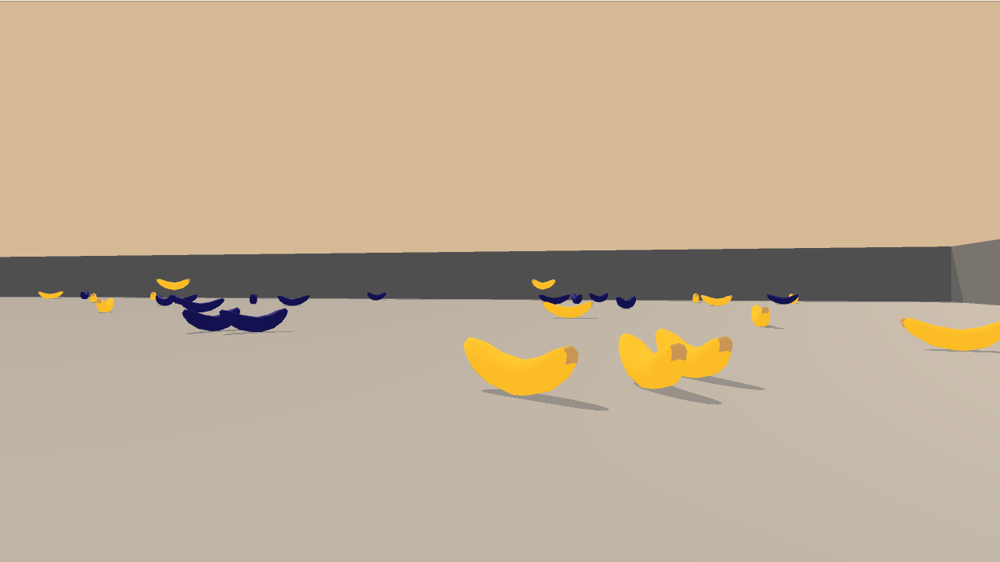

# DRL Navigation Project
This project is for the Udacity Deep Reinforcement Learning Nano Degree program. The goal of this project is to train the agent to collection as many yellow banana as possible using Deep-Q Network.

## Getting Started
Following the instruction below to setup your development environment.
1. Download this repository.
2. Download one of the Unity Environment based on your operating system.
    - Linux: [click here](https://s3-us-west-1.amazonaws.com/udacity-drlnd/P1/Banana/Banana_Linux.zip)
    - Mac OSX: [click here](https://s3-us-west-1.amazonaws.com/udacity-drlnd/P1/Banana/Banana.app.zip)
    - Windows (32-bit): [click here](https://s3-us-west-1.amazonaws.com/udacity-drlnd/P1/Banana/Banana_Windows_x86.zip)
    - Windows (64-bit): [click here](https://s3-us-west-1.amazonaws.com/udacity-drlnd/P1/Banana/Banana_Windows_x86_64.zip)

    Put the file in this repository folder and unzip the file.
3. Install Unity ML-Agents, NumPy and PyTorch by following the instruction from the link below.
    - [Unity ML-Agents](https://github.com/Unity-Technologies/ml-agents/blob/master/docs/Installation.md)
    - [NumPy](http://www.numpy.org/)
    - [PyTorch](https://pytorch.org/get-started/locally/)
4. Run jupyter notebook in the root of this repository, if you don't have it yet you can [click here](https://jupyter.org/install) to install.
5. Follow along the instruction in Navigation.ipynb to train and test the model.